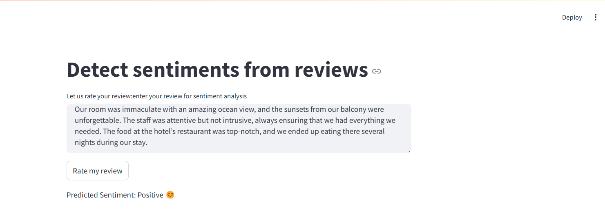

# Sentiment Analysis with Yelp Dataset

This repository contains a Jupyter notebook that performs sentiment analysis on the Yelp dataset. The dataset contains over 4,000 unique reviews and is used to train machine learning models to predict the sentiment of each review.

## Dataset

The dataset used in this analysis can be found [here](https://www.kaggle.com/datasets/omkarsabnis/yelp-reviews-dataset). It includes various features such as the text of the review, star ratings, and other metadata.

## Notebook Overview

The notebook `yelp.ipynb` covers the following steps:

1. **Data Loading and Exploration**
   - Importing necessary libraries.
   - Loading the dataset from `yelp.csv`.
   - Performing initial data exploration and visualization.

2. **Data Preprocessing**
   - Adding new features such as text length.
   - Removing punctuation and stopwords.
   - Tokenizing text and training a Word2Vec model.
   - Using TextBlob to compute sentiment scores.

3. **Data Visualization**
   - Visualizing the dataset using histograms, boxplots, correlation matrix and count plots.
   - Creating word clouds for 1-star and 5-star reviews.

4. **Model Training**
   - Splitting the data into training and testing sets.
   - Training various machine learning models including Naive Bayes, Random Forest, and Support Vector Machine (SVM).
   - Using pipelines and GridSearchCV for hyperparameter tuning.

5. **Model Evaluation**
   - Evaluating model performance using metrics such as accuracy, recall, f1-score and precision.
   - Printing the best parameters and scores from GridSearchCV.

## How to Run



1. Clone the repository:
   ```
   git clone https://github.com/bethanyjep/yelp_ghc_sentiment_analysis.git
   cd sentiment-analysis-yelp
   ```

2. Create a virtual python environment: `python3 -m venv venv`. And navigate to the environment you created:
   - Windows: `.\venv\Scripts\activate`
   - MacOS/Linux: `source env/bin/activate`

3. Install the necessary dependancies: `pip install -r requirements.txt`

4. Run the streamlit app
   `streamlit run yelp.py`

## Requirements
- pandas
- numpy
- matplotlib
- seaborn
- nltk
- gensim
- textblob
- scikit-learn
- wordcloud
- streamlit

## Results
The notebook evaluates the performance of the models using metrics such as accuracy, precision, recall, and F1 score. 

## Future Work
- Improve the performance of the machine learning models by experimenting with different features and hyperparameters.
- Explore other machine learning algorithms and techniques for sentiment analysis.
- Provide more detailed insights and recommendations based on the analysis.

## License

This project is licensed under the MIT License.